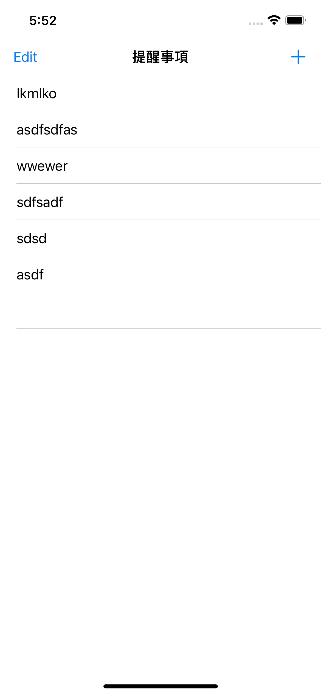

# TODOList
hello, I'm Roger, an IOS Developer
This project is practicing to make an todolist.

## Environment
* Xcode 13.3 +
* Snapkit package

## Features structure
* MVC struct
* UITableView
## Demo

